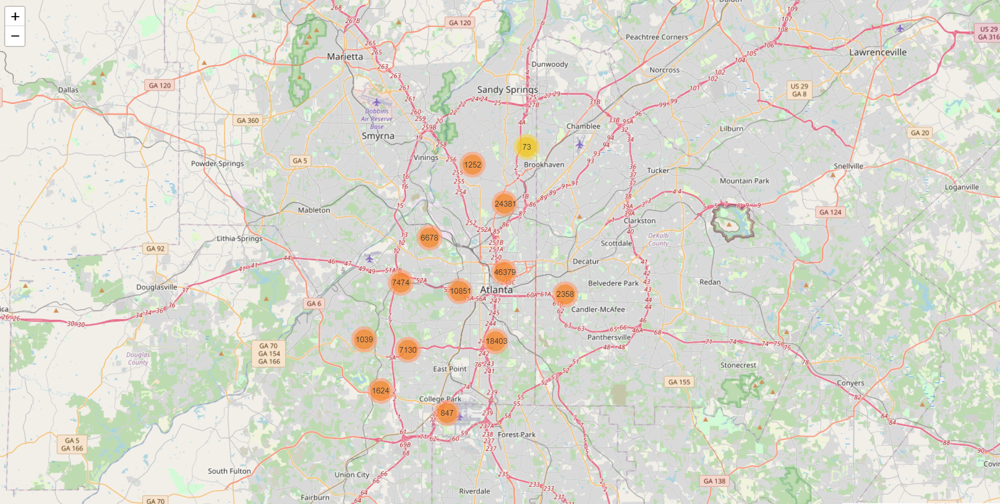
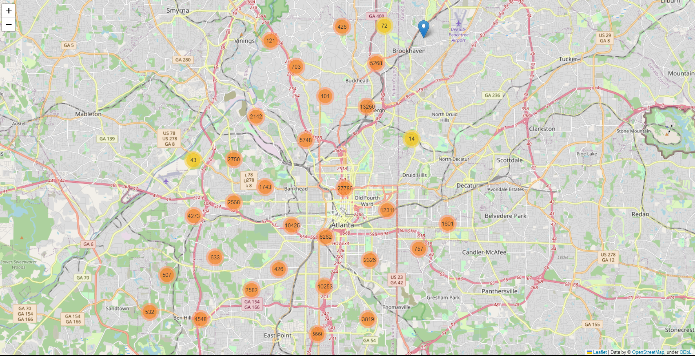

# Crime Density Map of Atlanta

Welcome to the Crime Density Map of the vibrant city of Atlanta! 🌆🗺️

## Overview

This webmap is the culmination of my Crime Analysis project, designed to shed light on crime patterns in Atlanta from 2016 to 2020. Through data visualization, we aim to better understand the distribution of criminal incidents across the city.

## Features

🔍 Interactive Visualizations: Explore crime hotspots and trends using our user-friendly web-based map.

📅 Historical Analysis: Dive into crime data spanning the years 2016 to 2020, uncovering patterns and shifts over time.

📍 Geospatial Insights: Gain a spatial perspective by visualizing crime density across different neighborhoods and districts.

## Data Source

The data used for this project has been meticulously collected and processed from official crime records, offering an accurate representation of the city's safety dynamics.

## Getting Started

To get started with exploring the crime density map, follow these steps:

1. Clone this repository: `git clone https://github.com/your-username/density-map.git`
2. Open the `index.html` file in your web browser.
3. Interact with the map and discover insights about crime patterns in Atlanta.

## Screenshots

_Explore crime hotspots and trends._

_Zoomed into hot zones._

## Contributions

Contributions to this project are always welcome! If you have ideas for improvements, new features, or data sources, please feel free to submit a pull request.

## License

This project is free to reproduce.

---

Ready to explore Atlanta's crime landscape? Let's get started! 🚀🔦
